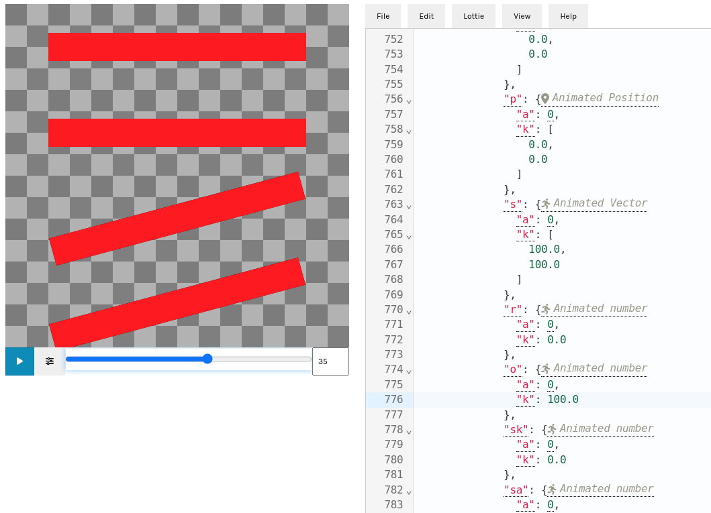

# iconimation
Exploratory hacking around use of a template Lottie to animate a font glyph

Don't count on anything working correctly.

## Usage

1. Find an icon font
   * Perhaps via https://fonts.google.com/icons?
1. Find the codepoint of the icon
   * If using fonts.google.com, click the icon and look for the heading "Code point" in the right hand pane
1. Obtain an icon font binary
   * `git clone git@github.com:google/material-design-icons.git` perhaps
1. Replace a placeholder in the template with an icon

    ```shell
    # Example assumes that:
    # 1) We are in the root of this repo
    # 2) git@github.com:google/material-design-icons.git is cloned sibling to current directory
    # 3) git@github.com:rsheeter/bodymovin-rs.git is cloned sibling to the current directory
   

    # I definitely need a Lottie that doesn't do anything!
    $ cargo run -- --icon 0xeba8 --font '../material-design-icons/variablefont/MaterialSymbolsOutlined[FILL,GRAD,opsz,wght].ttf' --animation none

    # A spin perhaps?
    $ cargo run -- --icon 0xeba8 --font '../material-design-icons/variablefont/MaterialSymbolsOutlined[FILL,GRAD,opsz,wght].ttf' --animation twirl-parts --spring

    # I have my own template!
    $ cargo run -- --icon 0xeba8 --font '../material-design-icons/variablefont/MaterialSymbolsOutlined[FILL,GRAD,opsz,wght].ttf' --animation none --template resources/templates/ScaleRotate.json
    ```

1. Try it out
   * https://lottiefiles.github.io/lottie-docs/playground/json_editor/ perhaps?
   * To generate a lottie and place it on the copy buffer so you can paste it into ^
   `$ cargo run -- --icon 0xeba8 --font '../material-design-icons/variablefont/MaterialSymbolsOutlined[FILL,GRAD,opsz,wght].ttf' --animation twirl-parts  && cat output.json | xclip -selection c`

   

To produce a demo with several samples run `makedemo.sh`.

## Wasm demo

```shell
# Once
$ cargo install wasm-pack

# Each time
$ wasm-pack build iconimation-wasm --target web
$ (cd iconimation-wasm && python -m http.server 8010)
# load http://localhost:8010/demo.html
```


## Templates

A template should:

* Have a group named "placeholder"
* Have a single square rectangle within that group
* Animate the square, such as by using transforms

The square will be replaced by an icons path(s), resulting in all icons knowing how to perform an animation.
